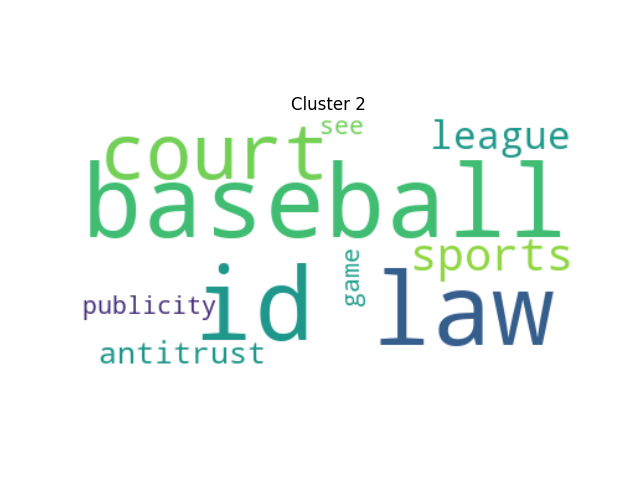
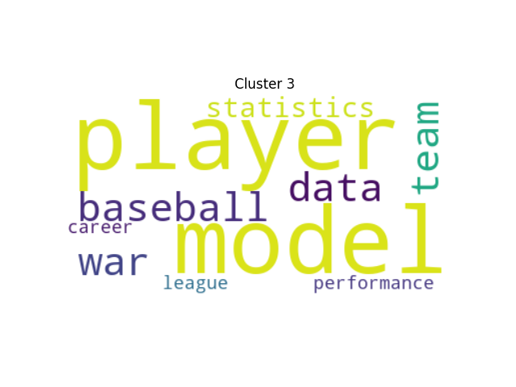

# Document Classifier implemented with heap data structure

This project introduces an approach to document clustering, employing Term Frequency-Inverse Document Frequency (TF-IDF) and cosine similarity, implemented with heap data structures. This algorithm is designed to aid users in organizing documents within a directory in a computationally optimized way. By leveraging the heap data structure's average time complexity of O(log n) for insertions and deletions, we aim to improve performance when dealing with large datasets.

The algorithm calculates the similarity between each document using cosine similarity and TF-IDF, powerful techniques in the text analysis field. By doing so, it can effectively group similar documents based on their content. This project serves as a guide for individuals and organizations who wish to optimize their document clustering process, thereby saving time and computational resources.


## Dependencies

- Python 3
- matplotlib
- networkx
- scipy
- nltk
- sklearn
- [draw_heap (local module)](#Draw_Heap)
- [pdf_reader (local module)](#PDF_Reader)
- [K_means_cluster (local module)](#K_Means)
- [read_docx_tf_idf (local module)](#K_Means)
- [lsa (local module)](#lsa)

## Instructions
1. Install all the required dependencies. You can use pip to install these packages. For example:
```
pip install matplotlib networkx scipy nltk sklearn PyPDF2 wordcloud
```
2. Clone or download this repository to your local machine.

3. You will need the modules draw_heap, pdf_reader, document_clf, lsa, main, and K_means_cluster to be located in your Python path or the same directory.

4. Run main.py file with the provided test_data within the repository. If it is run without any error, change the ‘source_dir’ to your source directory to be clustered and run the main.py again.
    ```
    python3 main.py
    ```
5. After you have run the main.py file, the script will ask for your input via the terminal for the number of clusters you want to use for document clustering. You can input this as an integer. For example:
    ```
    how many clusters do you want to use?: Press 0 to exit: 0
    ```
If you are unsure of the optimal number of clusters to use, simply enter a range of numbers to be clustered. The script will then generate a plot and print the inertia value for each number of clusters, like so:
    ```
    Intertia for k = 1: 0.003328
    Intertia for k = 2: 0.003160
    Intertia for k = 3: 0.002931
    Intertia for k = 4: 0.002753
    ```


These are the results of the elbow method for determining the optimal number of clusters. The inertia is a measure of how internally coherent clusters are. It decreases with an increase in k. However, the rate of decrease slows at some point forming an elbow shape in the plot. The optimal number of clusters is typically chosen at this point (the elbow point). So, observe the output values, check where the inertia value decreases significantly, indicating that the number of clusters (k) is optimal.

After you have determined the optimal number of clusters, enter this optimal number when prompted.

6. Once you've input the number of clusters for your document analysis, the program will also generate a WordCloud image for each of these clusters.
   
## Output
- The output is comprised of multiple elements. Here is an overview:

    - **Topic Words**: These are the key terms or keywords that define a particular topic. They are identified based on the frequency and relevance in the documents being analyzed. For instance, "august, season, average, slugging, home, last, surge" and "award, position, gold, player, may, defensive, model" are the topic words for two documents.

    - **Topic keywords from K means clustering**: K-means clustering is applied to the dataset, and each cluster's topic words are identified. These words represent the central theme or topics within each cluster and are derived from the frequency and relevance of the words in the documents within the respective cluster.
 
    - **Average cosine similarity of the best heap**: This is a measure of the average similarity between the documents in the best heap. A heap in this context is a collection of documents. Cosine similarity is a metric used to determine how similar two documents are irrespective of their size.
      
    - **Best Heap**: This contains tuples of document indices, the document's vector representation (in sparse matrix format), the cosine similarity of the document with the centroid of its cluster, and the name of the document. Each tuple corresponds to a document in the dataset.
        ```
        (document_index, document_vector_representation, cosine_similarity, document_name)
        ```
        - For example: (1, <1x4251 sparse matrix of type '<class 'numpy.float64'> with 1740 stored elements in Compressed Sparse Row format>, 1, 'attendance_strike_effects_variable_price_year_season.pdf')

    - **Silhouette Score**: This is a measure of how similar an object is to its own cluster compared to other clusters. The silhouette scores range from -1 to 1, where a high value indicates that the object is well matched to its own cluster and poorly matched to neighboring clusters.
 
    - **WordCloud Image**: size of each word in the WordCloud will correspond to its frequency within the cluster. The more frequent a word, the larger it will appear in the WordCloud. The WordCloud is an additional tool to help you visualize the key terms or themes in your documents. It doesn't replace the quantitative measures provided in the output, such as the Average Cosine Similarity, the Silhouette Score, or the Matrix of Data Points. Rather, it complements these measures by providing a qualitative perspective.
By using these different components together, you should have a comprehensive understanding of the clusters in your documents.

    - **Best Heap Visualization**: A visual representation of the best heap structure determined by cosine similarity is also provided in the output. Each node in the heap structure represents a document in your data set, and the hierarchy is determined by the cosine similarity between the documents.
      
    - This visualization is designed to give you an intuitive understanding of the relationships between the documents based on their cosine similarity. The root of the heap represents the document that is most similar to others, based on the average cosine similarity. Each subsequent level of the heap represents documents that are less similar to the rest of the data set.
      
        - Heap Structure: The heap structure is a binary tree, with the root representing the document with the highest average cosine similarity to the other documents. Each subsequent level of the tree represents documents with decreasing similarity.

        - Node Details: Each node in the tree will display the name of the document.

        - Heap Visualization File: The heap visualization will be saved as an image file in the working directory of the program, named as 'best_heap_visualization.png'.

## Expected Output
An example of expected output would look like this:
```
Topic words: ai,fairness,equal,gender,treatment,product,model
Topic words: ai,fairness,layer,data,model,bias,system
Topic words: ai,game,interaction,player,human,design,play
Topic words: ai,game,learning,harm,card,business,feature
Topic words: ai,game,strategy,player,superhuman,every,human
Topic words: classification,ocular,trauma,globe,injury,system,eye
Topic words: end,movie,service,cloud,latency,streaming,load
...

how many clusters do you want to use?: Press 0 to exit: 4 
___________________________
Intertia for k = 1: 0.003328
Intertia for k = 2: 0.003115
Intertia for k = 3: 0.002990
Intertia for k = 4: 0.002751
...
___________________________
Topic keywords from K means clustering: 
-----------------------
Cluster 0:
ai game fairness player learning bias interaction layer strategy human
Cluster 1:
service cloud performance simulator load resilience architecture circuit movie progression
Cluster 2:
speed ball baseball sports stadium sport spin batting ban outdoor
Cluster 3:
ocular trauma classification adnexal globe eye foreign irritation injury drug
__________________________________________
Best Single Heap:
________________________________________
[(1, <1x5598 sparse matrix of type '<class 'numpy.float64'>'
        with 1310 stored elements in Compressed Sparse Row format>, 1, 'ai_fairness_equal_gender_treatment_product_model.pdf'), (2, <1x5598 sparse matrix of type '<class 'numpy.float64'>'
        with 951 stored elements in Compressed Sparse Row format>, 0.6512978340782284, 'ai_fairness_layer_data_model_bias_system.pdf'), (3, <1x5598 sparse matrix of type '<class 'numpy.float64'>'
        with 1512 stored elements in Compressed Sparse Row format>, 0.40607807655477135, 'ai_game_interaction_player_human_design_play.pdf'), (4, <1x5598 sparse matrix of type '<class 'numpy.float64'>'
        with 940 stored elements in Compressed Sparse Row format>, 0.6521082888246671, 'ai_game_learning_harm_card_business_feature.pdf'), (5, <1x5598 sparse matrix of type '<class 'numpy.float64'>'
        with 548 stored elements in Compressed Sparse Row format>, 0.6324973521367505, 'ai_game_strategy_player_superhuman_every_human.pdf')]
Average cosine similarity of the best heap: 0.6683963103188834
Average Cosine Similarity for K means clusters: 0.42510646550287307
silhouete coeff score: -0.14551093338715193
```
- 
- 
- 

## Additional Information
- The document_clf class handles the main functionality. It takes in a source directory of documents and constructs a TF-IDF matrix. This matrix is then used to calculate cosine similarities between documents and form heaps based on these similarities. It can also generate and plot an elbow graph for K-means clustering.

- The get_document_names method extracts all the document names from the source directory.

- The get_heap method is similar to draw_every_heap but does not produce visualizations for each heap.

- The draw_best_heap function from draw_heap module is used in the main function to visualize the "best" heap.

Note: Please adjust the threshold and k values (the number of most similar documents to return) according to your specific use case in the get_heap and draw_every_heap methods. The threshold is currently set to 0.2 and k to 15.

This script assumes that the documents to be analyzed are in PDF and docx format. Please ensure that the pdf_reader module functions pdf_to_text, read_pdf_tf_idf, and get_combined_token_dict are able to read your documents.

## Draw_Heap

- The scripts require a heap data structure as input. The heap should be a binary tree of tuples where each tuple contains a similarity score and a pair of documents. Replace the placeholders in the draw_heap() and draw_best_heap() functions with your data.

- The draw_heap() function generates a pyramid-like visualization of the heap, with each node labelled with the corresponding document name. The size of the node represents its level in the heap. It saves the visualization as a .png image and displays it.

- The draw_best_heap() function does the same as draw_heap() but is specifically designed to highlight the "best" heap configuration.

Note: The script does not build or manage the heap data structure. It is assumed that you have already generated the heap and are providing it as input to the draw_heap() and draw_best_heap() functions.

## pdf_reader

- This Python script provides functions to extract key topics from .docx and .pdf files and renames the files based on the extracted topics. The script is implemented in Python and utilizes several libraries such as PyPDF2, NLTK, scikit-learn, and a custom module named read_docx_tf_idf.

- This script performs several operations on .docx and .pdf files. It starts by extracting text from the files, tokenizing the text, removing stopwords, and then identifies key topics using Latent Semantic Analysis (LSA).
  
- The identified key topics are used to rename the files. The original files will be renamed, so please ensure that you have a backup of your files if necessary.
  
- The get_combined_token_dict() function creates a combined dictionary of the extracted text from the .docx and .pdf files and preprocesses the text before further operations.
  
- Non-English words and words not in the NLTK words corpus are filtered out during preprocessing.

## K_means_cluster
- This Python script implements K-Means clustering on a collection of documents represented in a TF-IDF matrix, identifying optimal cluster count using the Elbow method and visualizing results using word clouds.
  
- The K_means_cluster() function performs K-Means clustering on the input TF-IDF matrix and returns a dictionary mapping document names to their respective cluster labels.
  
- The plot_k_means() function performs K-Means clustering and visualizes the top terms in each cluster with word clouds.

## read_docx_tf_idf

- This script performs text extraction, tokenization, and cleaning of .docx files. It removes stopwords and non-alphabetic words from the text.
  
- The function read_docx_tf_idf() reads the .docx files, extracts and cleans the text content, and finally stores the cleaned text in a dictionary.
  
- The dictionary contains the filename as the key and its cleaned text as the value.
  
- This script requires a directory of .docx files to be processed. Replace source_dir in the main function with the path to your directory.

## LSA
- Extracting Topics from Documents
- Script includes two functions, extract_topic_docx(source_dir, num_topics=3) and extract_topic_pdf(pdf_token, num_topics=3), that leverage Latent Semantic Analysis (LSA) to extract topics from the preprocessed DOCX and PDF files respectively.
- Extracted topic keywords are then used to rename files.

    - extract_topic_docx(source_dir, num_topics=3): This function reads the preprocessed DOCX files from the source directory using the read_docx_tf_idf function. The resulting list of preprocessed text data is then transformed into a TF-IDF matrix using TfidfVectorizer. LSA is applied to this matrix using the TruncatedSVD function from sklearn, specifying the number of topics to extract (default is 3). The function then prints out the top 5 words for each topic, giving us an idea of the main themes in the DOCX files.

    - extract_topic_pdf(pdf_token, num_topics=3): This function works similarly to extract_topic_docx but operates on preprocessed text data from PDF files. It transforms the provided text data into a TF-IDF matrix, applies LSA, and then extracts the specified number of topics (default is 3). The function then prints out the top 7 words for each topic. Additionally, it returns the top words from each topic combined with underscores, which could be used for renaming the processed PDF files based on their topics.

    - These two functions enable us to perform topic modeling on our document corpus, providing insights into the main themes present in our data. The number of topics and the number of top words to display for each topic can be adjusted based on your specific needs.

## Hyperparameter Tuning
- The grid_search function has been incorporated into the algorithm to optimize the performance of the document classifier. This function takes in a range of potential k values (the number of documents to return for a single heap structure), and finds the one that provides the highest average cosine similarity in the heap.

- The optimal k value signifies the number of most similar documents that the algorithm should return. The selection of the range of k values to test in the grid search is a critical step, and it can significantly impact the performance of the classifier.

- Here's a sample usage of the grid_search function:

        ```
        # Initialize Document Classifier
        doc_classifier = DocumentClassifier()
        
        # Define range of potential k values
        k_values = range(1, 101)
        
        # Perform grid search to find optimal k
        best_k, best_avg_sim = doc_classifier.grid_search(k_values)
        
        print("The optimal k value is:", best_k)
        print("The average similarity for the optimal k is:", best_avg_sim)
        ```

- The returned optimal k is then used in the get_best_heap_cosine function to determine the heap structure that returns the documents with the highest average similarity. This ensures that the algorithm is tuned for optimal performance for your specific dataset. The average cosine similarity of the best heap signifies the overall relevance of the documents returned by the classifier.

- Please note that the range of k_values passed to the grid_search function may need to be adjusted based on the size and nature of your dataset.
